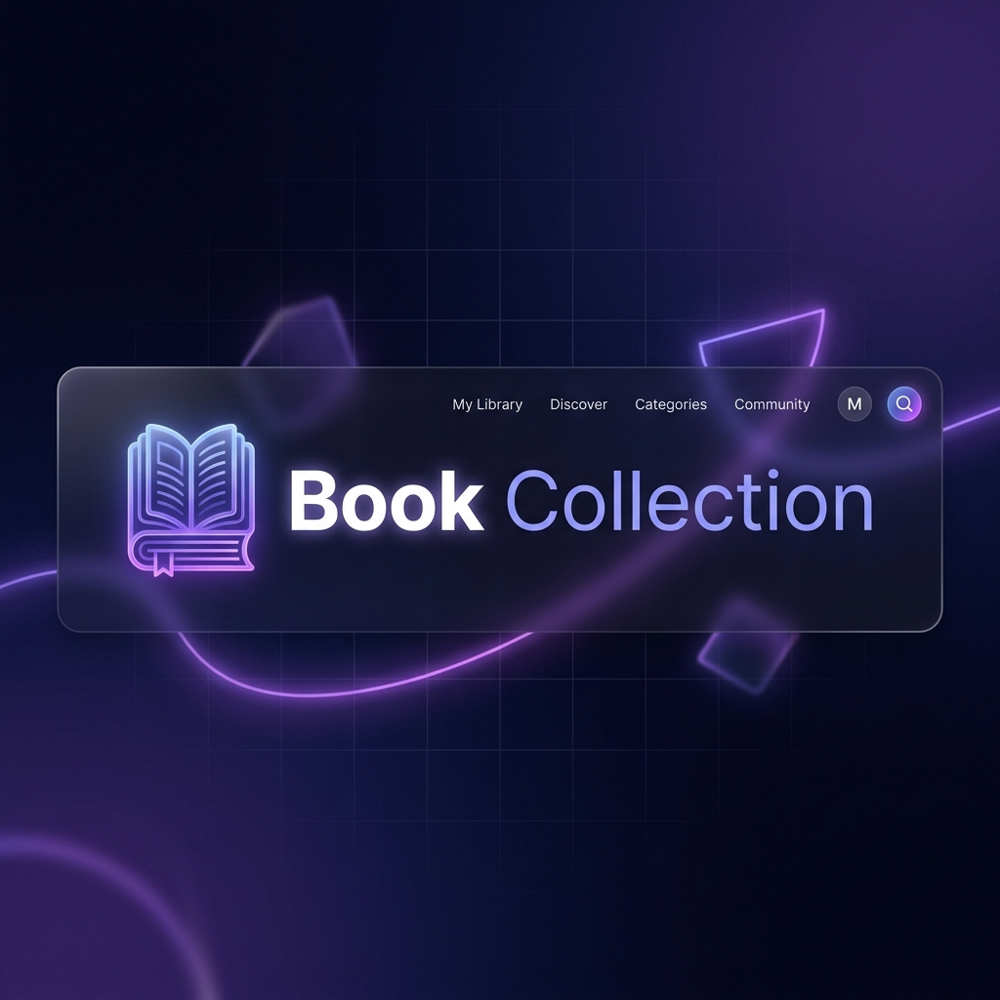

# 📚 Book Collection — Full-Stack API Dashboard



[](https://www.typescriptlang.org/)
[](https://vitejs.dev/)
[](https://nodejs.org/)
[](https://www.mongodb.com/)
[](https://expressjs.com/)

A professional, high-performance, and strictly-typed **Full-Stack Book Management Dashboard**. Built with a focus on clean architecture, modern UI/UX, and end-to-end TypeScript integration.

---

## ✨ Key Features

- 🛠️ **Full CRUD Operations**: Create, Read, Update (PATCH/PUT), and Delete books with ease.
- 🚀 **Vite-Powered Frontend**: Blazing fast development server and optimized production builds.
- 🏗️ **Robust Backend**: Node.js/Express architecture using the **Route-Controller-Service** pattern.
- 🛡️ **End-to-End TypeScript**: Shared models and strict typing from the database to the browser UI.
- 🔍 **Smart Search**: Find books instantly using unique MongoDB ObjectIDs.
- 📄 **Pagination**: Seamless handling of large datasets with paginated API endpoints.
- 🎨 **Premium UI/UX**:
  - Glassmorphism design and responsive layouts.
  - Real-time **Toast Notifications** for every action.
  - Safety-first **Delete Confirmation Modals**.
  - Intelligent form validation and error handling.

---

## 🛠️ Tech Stack

### Frontend
- **Language**: TypeScript
- **Bundler**: Vite
- **Styling**: Vanilla CSS (Modern CSS variables & Grid)
- **UI Components**: custom Glassmorphism components

### Backend
- **Runtime**: Node.js
- **Framework**: Express.js
- **Language**: TypeScript
- **Database**: MongoDB (Mongoose ODM)
- **Tooling**: `tsx` (TypeScript Execution)

---

## 📂 Project Structure

```text
├── data/               # Seed data for immediate dashboard population
├── public/             # Static public assets
├── src/
│   ├── client/         # Frontend TypeScript Source
│   │   ├── styles/     # 🎨 Modular CSS System (vars, layout, components)
│   │   ├── types.ts    # Global interface definitions
│   │   ├── apiClient.ts# Smart API origin resolution
│   │   ├── config.ts   # Typed API endpoints dictionary
│   │   └── ...         # Modular UI logic (render, form, modal, search)
│   └── server/         # Backend TypeScript Source
│       ├── controllers/# API route handlers
│       ├── database/   # Mongoose connection logic
│       ├── middlewares/# Error handling & request logging
│       ├── models/     # Mongoose schemas & TypeScript interfaces
│       ├── routes/     # Express REST endpoints
│       ├── services/   # Core business logic & database queries
│       └── app.ts      # Main Express initialization
├── index.html          # Vite entry hub
├── vite.config.ts      # Vite configuration & proxy routes
├── tsconfig.*.json     # Solution-style TypeScript configurations
└── package.json        # Project metadata and build scripts
```

---

## 🚀 Getting Started

### 1. Prerequisites
- [Node.js](https://nodejs.org/) (v18+)
- [MongoDB](https://www.mongodb.com/try/download/community) (Local or Atlas)

### 2. Configuration
Create a `.env` file in the root directory:
```env
PORT=5000
NODE_ENV="development"
DOMAIN_NAME='localhost'
MONGO_URI_DEV="mongodb://127.0.0.1:27017/bookstore"
MONGO_URI_PROD="your_atlas_connection_string"
```

### 3. Installation
```bash
npm install
```

### 4. Running the Project
```bash
# Start both Frontend & Backend (Development)
npm run dev

# Build the project for Production
npm run build

# Start the Production server
npm run start
```

---

## 💾 Seeding the Database

We provide a starter dataset to help you see the dashboard in action immediately. You can find it in `data/books-seed.json`.

### Local MongoDB
If you are running MongoDB locally, use `mongoimport` to load the data into your `bookstore` database:
```bash
mongoimport --db bookstore --collection books --file data/books-seed.json --jsonArray
```

### MongoDB Atlas (Production)
To seed your live Atlas database, use the following command (replace placeholders with your Atlas details):
```bash
mongoimport --uri "mongodb+srv://<username>:<password>@cluster.mongodb.net/bookstore" --collection books --file data/books-seed.json --jsonArray
```

---

## 🛡️ Architecture & Scalability

This project is built using a **Modular Domain Pattern**. The frontend and backend are decoupled but share consistent type definitions.
- **Backend**: Uses a Service layer to keep business logic separate from HTTP logic, making it easy to add unit tests or switch databases.
- **Frontend**: Uses a modular DOM Registry and specialized workers for Rendering, Forms, and State to prevent "Spaghetti Code."

---

## 🤝 Contributing
Contributions, issues, and feature requests are welcome!

## 📝 License
This project is [MIT](https://opensource.org/licenses/MIT) licensed.
